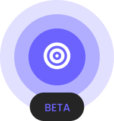

<!-- markdownlint-disable-next-line -->
<p align="center">
  <a href="https://opendartboard.org/" rel="noopener" target="_blank"></a>
</p>

<h1 align="center">OpenDartboard</h1>

<div align="center">

[](https://github.com/opendartboard/opendartboard)
[](https://github.com/opendartboard/opendartboard)
[](https://github.com/opendartboard/opendartboard)
[](https://github.com/opendartboard/opendartboard)
[](https://github.com/opendartboard/opendartboard)

</div>

**OpenDartboard** is a hobby-friendly, fully FOSS toolkit for building an automatic _steel-tip_ dart–scoring station:

- **Headless Scorer** — Uses a Raspberry Pi Zero 2 W with 3 cameras to detect darts and output scores in standard notation (T20, S5, D12, …) via a easy to consume WebSocket API.
- **Computer Vision** — Lightweight OpenCV to run efficiently on a Pi Zero 2 W.

The goal: **drop-in freedom** for home tinkerers who want "Automatic darts scoring" without closed hardware, subscriptions, or vendor lock-in.

## Table of Contents

- [Quick Start](#quick-start)
- [Recommended Clients](#recommended-clients)
- [Project Status & Roadmap](#project-status--roadmap)
- [Tech Stack](#tech-stack)
- [Hardware Reference](#hardware-reference)
- [Development Environment](#development-environment)
- [API Documentation](#api-documentation)
- [Custom Detectors](#custom-detectors)
- [Contributing](#contributing)

---

## Quick Start

```shell
# 1 Flash MicroSD with Rasbperi Pi Imager (https://www.raspberrypi.com/software/) | Image: Raspberry Pi OS Lite (64-bit)
# 1.1 - set hostname to `opendartboard`.
# 1.2 - set username as `pi`, and any password.
# 1.3 - set Wi-Fi name and password.
# 1.2 - enable SSH in services.
# 1.4 - Flash MicroSD - once complete power on Raspberry Pi
# 1.5 - Connect to it with terminal/cmd using SSH:
ssh pi@opendartboard.local

# 2. Update the package lists
sudo apt-get update

# 3. Download & install the latest .deb release
wget https://github.com/OpenDartboard/OpenDartboard/releases/download/v0.1.2/opendartboard_0.1.2-1_arm64.deb
sudo apt install -y ./opendartboard_0.1.2-1_arm64.deb

# 4. Run it and Watch the scores
opendartboard --autocams
```

> **Tip**: Need a quick debug dashboard? Run [`opendartboard.github.io/debug`](https://opendartboard.github.io/debug/) in any modern browser to see the score output, camera feeds, calibrations images, and more.

## Recomended Clients

```yml
- **Web**:     [COMMING SOON] - A web client for viewing scores and managing settings.
- **Android**: [COMMING SOON] - A native Android app to connect to your OpenDartboard server.
- **iOS**:     [COMMING SOON] - An iOS app to connect to your OpenDartboard server.
- **Tablet**:  [COMMING SOON] - A tablet client for viewing scores and managing settings.
- **Windows**: [COMMING SOON] - A Windows client for viewing scores and managing settings.
- **Linux**:   [COMMING SOON] - A Linux client for viewing scores and managing settings.
- **macOS**:   [COMMING SOON] - A macOS client for viewing scores and managing settings.
- **TV's**:    [COMMING SOON] - A TV client for viewing scores on your big screen.
```

## Project Status & Roadmap

| Phase           | Target                                             | Status (ETA) |
| --------------- | -------------------------------------------------- | ------------ |
| **Packaging**   | Debian package (.deb) for easy installation        | ✅ released  |
| **Development** | Docker‑based dev environment for consistent builds | ✅ ready     |
| **MVP**         | Basic Auto‑calibration via OpenCV                  | ✅ done      |
| **CI/CD**       | Basic CI pipelines & tagged releases               | ✅ live      |
| **MMR**         | Scoring via OpenCV (`geometry_detector`)           | 🚧 WIP       |
| **API**         | WebSocket API for real‑time score streaming        | ✅ v0.1      |
| **Polish**      | Improved accuracy & self‑calibration               | 🗓 T.B.D.     |

---

## Tech Stack

| Layer               | Tech                         | Notes                                |
| ------------------- | ---------------------------- | ------------------------------------ |
| **Computer Vision** | `OpenCV`                     | INT8‑optimised model for ARM         |
| **Runtime**         | C++                          | High‑performance dart detection      |
| **API**             | `WebSocket` · `JSON`         | Real‑time score streaming on `13520` |
| **Infrastructure**  | `systemd` · `udev`           | Robust auto‑start & camera hot‑swap  |
| **Development**     | `Docker` · `Debian Bullseye` | Reproducible builds                  |
| **Distribution**    | `.deb` package               | CI‑checked, one‑command install      |

---

## Hardware Reference

| Item         | Minimum spec                                       | Example                       |
| ------------ | -------------------------------------------------- | ----------------------------- |
| SBC          | Raspberry Pi Zero 2 W (+ self-powered USB 2 hub)   | Waveshare USB HUB HAT (B)     |
| Cameras (×3) | USB 2.0 webcams outputting MJPEG @ 1280x720 30 fps | HBVCAM OV2710 100°            |
| Lighting     | 360° LED ring                                      | DIY SmartLite 12 V LED 6000 K |
| Power        | 5 V / 3 A PSU                                      | Any USB PD brick + adapter    |

---

## Development Environment

```sh
# Clone repository
git clone https://github.com/OpenDartboard/OpenDartboard.git
cd OpenDartboard

# Build the dev image (once)
docker compose build opendartboard

# Open an interactive shell with everything mounted
# Run `$env:PWD = (Get-Location).Path` #FOR WINDOWS
docker compose run --rm --service-ports opendartboard /bin/bash

# Builds and installs binary
make build

# Run the binary with mocks
opendartboard --debug --cams mocks/cam_1.mp4,mocks/cam_2.mp4,mocks/cam_3.mp4 --width 1280 --height 720
```

## API Documentation

See [`docs/api.md`](docs/api.md) for the full WebSocket specification & client examples.

## Custom Detectors

Want to experiment with your own CV pipeline? Check out [`docs/detectors.md`](docs/detectors.md) for implementation guides and examples.

## Contributing

Pull requests are welcome — but please open an issue first so we can discuss design & approach. 🎯
